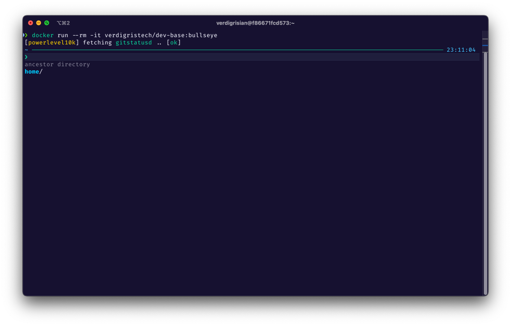

# docker-dev-base

![Downloads][shield-docker-downloads]
![Image Size][shield-docker-size]

Base image for setting up VS Code development environments.

## Overview

This image is based on [bitnami/minideb][minideb] image with [Zsh][zsh] as the
default shell. It also includes [Oh My Zsh][oh-my-zsh] framework with some
plugins pre-installed.

### Pre-installed userland tools

- `bat` (enhanced `cat`)
- `curl`
- `git`
- `glow`
- `gpg`
- `less`
- `lsd` (enhanced `ls`)
- `ssh` (client toolchain only)
- `sudo`

### Pre-installed Zsh plugins

- [F-Sy-H][f-sy-h] (syntax highlighting)
- [git][git] (git branch annotations)
- [zsh-autocomplete][zsh-autocomplete] (auto completion)
- [zsh-autosuggestions][zsh-autosuggestions] (auto suggestions)

Can overwrite these using `ZSH_PLUGINS` environment variable with a comma delimited list.

### Zsh Customization

You can provide a path to your own zshrc file using `ZSHRC_OVERWRITE`. Example to add an untracked `local` folder with a zshrc and mount the folder. Then provide this env variable to overwrite.

To just extend functionality you can use `ZSHRC_EXTRA` which will source extra zshrc startup content including PATH overwrites if desired.

## Supported tags

- bullseye, 11

---

Copyright © 2022-2023 Verdigris Technologies, Inc. All rights reserved.

[shield-docker-downloads]: https://img.shields.io/docker/pulls/verdigristech/dev-base?style=flat-square
[shield-docker-size]: https://img.shields.io/docker/image-size/verdigristech/dev-base/11?style=flat-square
[minideb]: https://github.com/bitnami/minideb
[zsh]: https://www.zsh.org/
[oh-my-zsh]: https://ohmyz.sh/
[f-sy-h]: https://github.com/z-shell/F-Sy-H
[zsh-autocomplete]: https://github.com/marlonrichert/zsh-autocomplete
[zsh-autosuggestions]: https://github.com/zsh-users/zsh-autosuggestions
